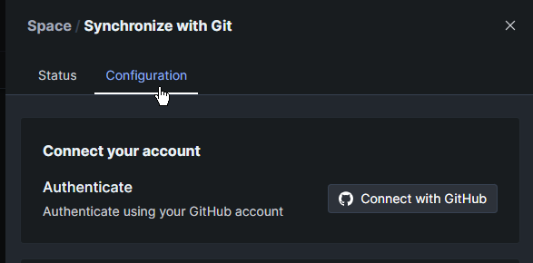

# Github 연동

Github 와 Gitbook 을 연동 할 수 있다.

* GitHub에서 markdown 문법으로 작성된 파일을 Gitbook 에서 볼수 있다.
* GItBook에서 작성된 것을  GitHub 에서 markdown 문법으로 볼 수 있다.

<figure><figcaption>
�뀋
</figcaption></figure>

1. 연동하려는 스페이스의 우측에  점세개 를 클릭
2. Synchronizewith Git 클릭

<figure><figcaption></figcaption></figure>

3. Configration 클릭
4. Connect With GitHub 클릭

